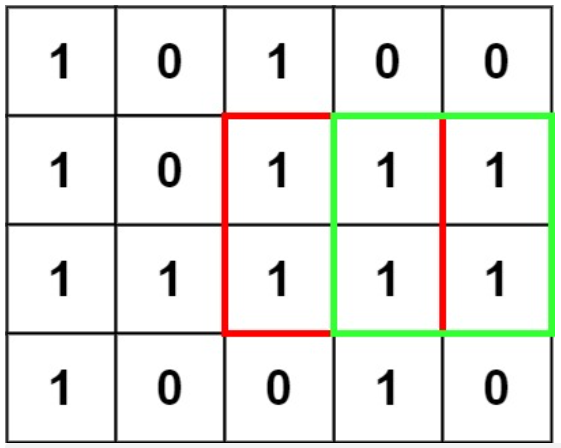

#### Medium

#### python 

### 题目：

在一个由 '0' 和 '1' 组成的二维矩阵内，找到只包含 '1' 的最大正方形，并返回其面积。

### 示例：

输入：



输出：4

<br/>

这种搜索正方形的题目使用动态规划一定要搞清楚dp代表什么意思。一般我们在这类题中dp[i][j\]是定义为正方形的右下角的面积。

状态转移矩阵就可以表示为：$$dp[i][j] = min(dp[i-1][j-1], min(dp[i][j-1], dp[i-1][j])) + 1$$

### 解法：

```python
class Solution:
    def maximalSquare(self, matrix: List[List[str]]) -> int:
        # dp[]i][j]表示以（i,j）右下角能组成的正方形的面积
        m,n,max_area = len(matrix),len(matrix[0]),0
        dp = [[0]*(n+1) for _ in range(m+1)]
        for i in range(1,m+1):
            for j in range(1,n+1):
                if matrix[i-1][j-1] == '1':
                    dp[i][j] = min(dp[i-1][j-1],min(dp[i][j-1],dp[i-1][j]))+1
                    max_area = max(max_area,dp[i][j])
        return max_area*max_area
        
```